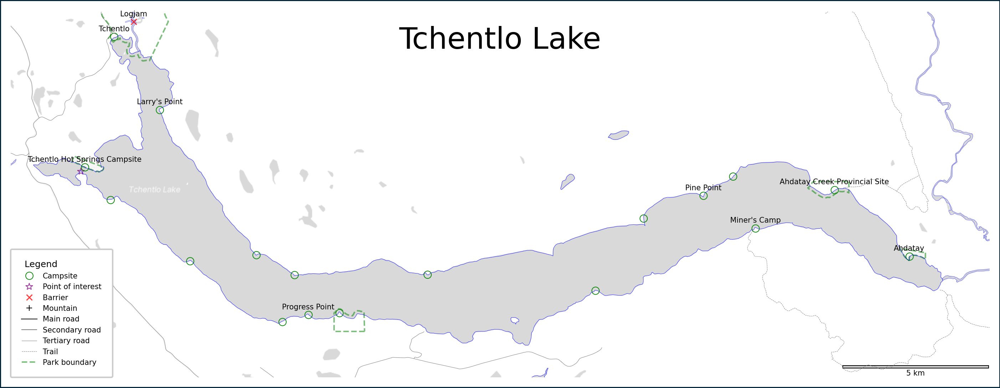

# canoe-mapping

## Motivation

I could not find any decent maps for a canoe trip of the Nation Lakes in northern BC, so I decided to make my own using OpenStreetMap and the OSMx library. By including tags relevant for canoe trips, these maps have are accurate for navigation and include the location of campsites (both official and unofficial) parks, and other useful features.

Here is an example:


## Setup

1. Create a new virtual environment

    ```bash
    conda env create --file environment.yml
    ```

2. [OPTIONAL] Go to [STADIA MAPS SITE](https://stadiamaps.com/stamen/onboarding/create-account) to get an api key so you can use the lovely StamenTonerLite background tiles. This looks best when printed on paper IMO.

    Save the api key as an environment variable by appending `export STAMEN_API_KEY="<api_key>"` to your `.bashrc` or `.bash_profile` file.

    ``` bash
    code ~/.bashrc
    ```
  
## Instructions

1. Create a json file with the name and latitude (north, south) and longitude (east, west) of the location(s) you want mapped. This can be found easily using google maps by clicking to drop a pin, then right-click to copy lat/lon. For example, for the 4 lakes of the Nation Lakes chain it would look like this:

  ```json
  [
    {"name": "Tsayta Lake", "north": 55.48292, "west": -125.650, "south": 55.41749450097668, "east": -125.31534497067527}, 
    {"name": "Indata Lake", "north": 55.3925, "west": -125.33, "south": 55.292, "east": -125.2175}, 
    {"name": "Tchentlo Lake", "north": 55.27724688304605, "west": -125.2879216313345, "south": 55.164542941519294, "east": -124.75996931606227}, 
    {"name": "Chuchi Lake", "north": 55.22210608559387, "west": -124.76407610865795, "south": 55.12837905899054, "east": -124.31095886659628}
  ]
  ```

2. Run `make_maps.py` with appropriate command line arguments, including:

    - `--dim <map dimension>` Maximum dimension of map when printed in inches (default=`10``)
    - `--places <json path>` Path to json file containing location info (default=`nation_lakes.json``)
    -  `--bg <tile>` Name of background tile to use, one of: `StamenToner`, `StamenTonerLite`, `StamenTerrain`, `GoogleMaps` (default=`StamenTonerLite`)
    
    ```bash
    python src/make_maps.py --place nation_lakes.json
    ```

3. Find maps in `maps/` folder. Enjoy!

## Improvements

Planned upgrades include:

- adding lat/lon gridlines
- whitewater tags for rapids, grades, etc
