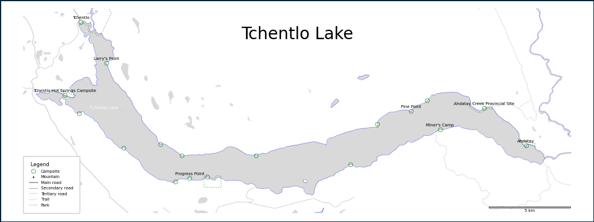

# canoe-mapping
I could not find any decent maps for a canoe trip of the Nation Lakes in northern BC, so I decided to make my own using OpenStreetMap and the OSMx library.

Here is an example:


# Setup
1. Create a new virtual environment
    ```
    conda env create --file environment.yml
    ```

2. [OPTIONAL] Go to [STADIA MAPS SITE](https://stadiamaps.com/stamen/onboarding/create-account) to get an api key so you can use the lovely StamenTonerLite background tiles.

    Save the api key as an environment variable by appending `export STAMEN_API_KEY="<api_key>"` to your `.bashrc` or `.bash_profile` file.

    ``` bash 
    code ~/.bashrc
    ```
  
  # Instructions

